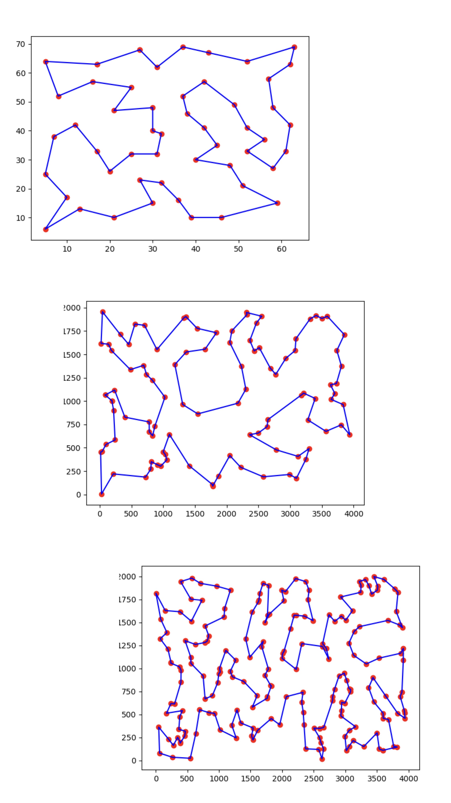
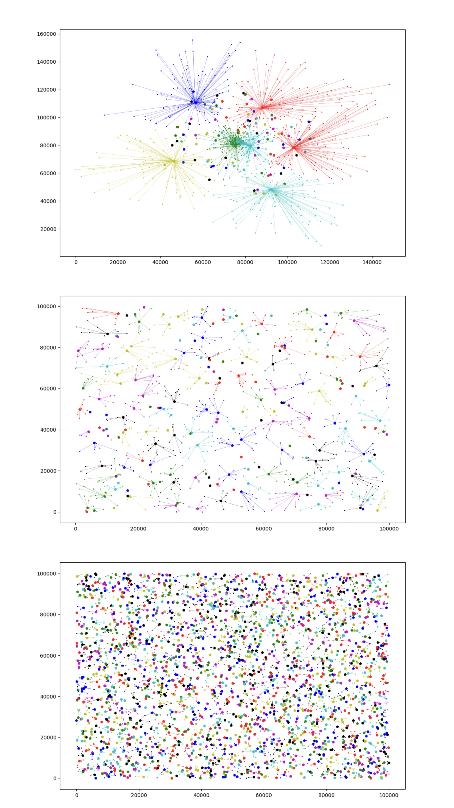
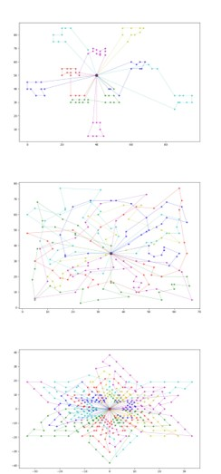

# Discrete Optimization Solver

## 01 Knapsack Problem

Method:
- Dynamic Programming
- Branch and Bound
- Greedy Heuristic

## 02 Graph Coloring Problem

Method:
- Depth First Search
- Constraint Programming

## 03 Traveling Salesman Problem

Method:
- Simulated Annealing
- K Opt
- Visualization

## 04 Facility Location Problem

Method:
- Branch and Bound
- Tabu Search
- Visualization

## 05 Vehicle Routing Problem

Method:
- Genetic Algorithm
- 2 Opt
- Variable Neighborhood Search
- Visualization

